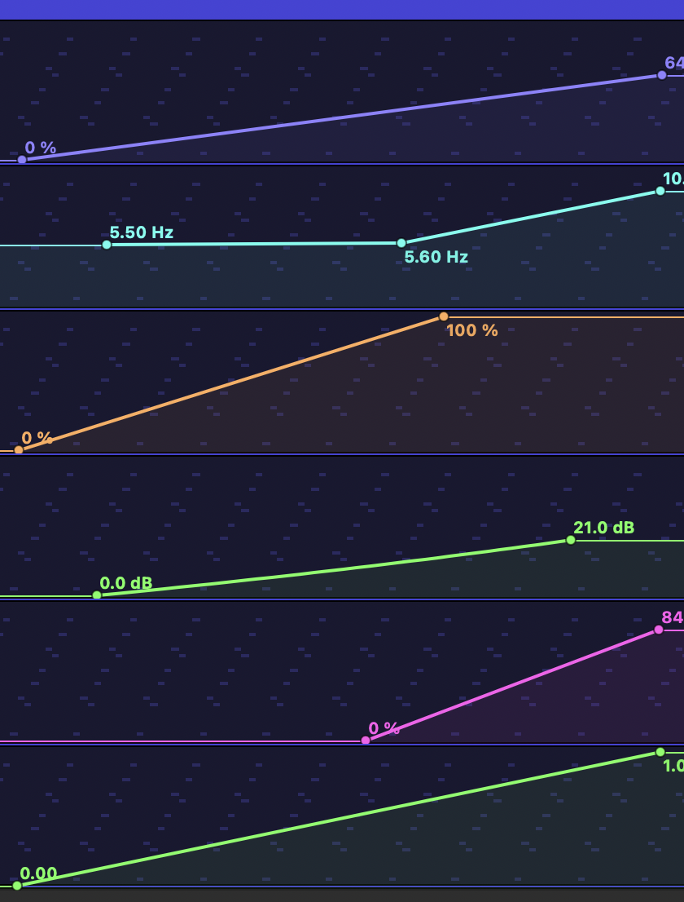

# Overall design deliverable
### Chosen focus:
In overleg met Ciska kies ik voor de custom focus, waarbij mijn custom de melody generation van 2b is die ik nog moet 
inhalen. Zo kan ik 2b en 2c combineren zonder al te veel achter te blijven lopen.

### Chosen effects:
De custom focus betekent 3 FX punten minimaal. Voor 2b maak ik een simpele organ synth mbv square waves, dus ik kies
voor effecten die ik leuk aan vind sluiten bij dit geluid.
- Het lijkt me tof (en haalbaar) om en een __vibrato__(1) te maken, omdat het 1 van mijn favoriete effecten
is en omdat het mooi samengaat met een organ. I like it dreamy!
- De __waveshaper__(1) is voorbij gekomen in de les en spreekt me ook aan.
Door zowel de simpliciteit als het karakter. Overstuurde orgels zijn niet ongebruikelijk maar wel heel vet.
- Een mooie derde toevoeging lijkt me een __feedback delay__(2). Enerzijds om het extra dreamy en groots te maken en
anderzijds omdat ik denk dat het bouwen daarvan haalbaar moet zijn voor mij met de tijd die ik heb. Als ik tijd
overhoud kan ik altijd nog naar nieuwe FX kijken maar voor nu: KISS.

### Parameters:

